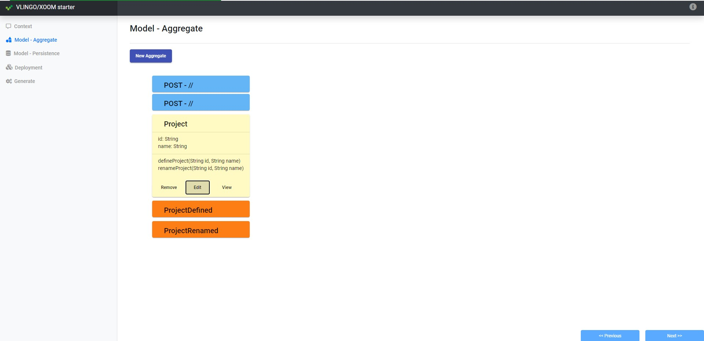

Example projects generated with vlingo-xoom-starter
-------------------

In order to generate the test projects, please download the latest 
[vlingo-xoom-starter][xoom-starter] distribution using the following command:

```bash
curl -L -O https://github.com/vlingo/vlingo-xoom-starter/raw/master/dist/starter.zip
```

As of writing this README, the version is [`1.3.4-SNAPSHOT`][xoom-starter-1.3.4].

Then unpack the `starter` and run it. E.g. on Windows you can run it using `xoom.bat gui`.

Follow the screenshots below to generate the example projects.

[xoom-starter]: https://github.com/vlingo/vlingo-xoom-starter
[xoom-starter-1.3.4]: https://github.com/vlingo/vlingo-xoom-starter/tree/61eea3dd759d18e0038089dd1b25fa7db36362b8

# Generate example with xoom annotations

1. Fill the generation context.
  
  


2. Define a new `Project` aggregate.
  
  Define aggregate fields and events.
  
  
  Define aggregate methods and API endpoints.
  

  The defined aggregate should looks like this:
  

3. Define Persistence configuration.
  
  
  
4. Define Deployment configuration.
  
  


5. Choose generation path and pick annotations usage.
  
  

After the project is generated, open it and build using the following command:

```bash
mvn clean install
```

The result of the command execution leads to the following build exception:

```
[INFO] --- maven-compiler-plugin:3.7.0:compile (default-compile) @ test-vlingo ---
[INFO] Changes detected - recompiling the module!
[INFO] Compiling 14 source files to <project-path>\test-vlingo\target\classes
[INFO] ------------------------------------------------------------------------
[INFO] BUILD FAILURE
[INFO] ------------------------------------------------------------------------
[INFO] Total time:  3.130 s
[INFO] Finished at: 2020-11-03T10:45:06+02:00
[INFO] ------------------------------------------------------------------------
[ERROR] Failed to execute goal org.apache.maven.plugins:maven-compiler-plugin:3.7.0:compile (default-compile) on project test-vlingo: Fatal error compiling: java.lang.IndexOutOfBoundsE
xception: Index: 0, Size: 0 -> [Help 1]
[ERROR]
[ERROR] To see the full stack trace of the errors, re-run Maven with the -e switch.
[ERROR] Re-run Maven using the -X switch to enable full debug logging.
[ERROR]
[ERROR] For more information about the errors and possible solutions, please read the following articles:
[ERROR] [Help 1] http://cwiki.apache.org/confluence/display/MAVEN/MojoExecutionException
```


# Generate example without xoom annotations

1. Fill the generation context.
  
  


2. Define a new `Project` aggregate.
  
  Define aggregate fields and events.
  
  
  Define aggregate methods and API endpoints.
  

  The defined aggregate should looks like this:
  

3. Define Persistence configuration.
  
  
  
4. Define Deployment configuration.
  
  


5. Choose generation path and do not check annotations.
  
  

After the project is generated, open it and build using the following command:

```bash
mvn clean install
```

The result of the command execution leads to the following build exception:

```
[INFO] --- maven-compiler-plugin:3.7.0:compile (default-compile) @ test-vlingo-no-annotations ---
[INFO] Changes detected - recompiling the module!
[INFO] Compiling 17 source files to <project-path>\test-vlingo-no-annotations\target\classes
[INFO] -------------------------------------------------------------
[ERROR] COMPILATION ERROR :
[INFO] -------------------------------------------------------------
[ERROR] <project-path>/test-vlingo-no-annotations/src/main/java/com/acme/test/vlingo/resource/ProjectResource.java:[34,12] cannot find symbol
  symbol:   variable project
  location: class com.acme.test.vlingo.resource.ProjectResource
[ERROR] <project-path>/test-vlingo-no-annotations/src/main/java/com/acme/test/vlingo/resource/ProjectResource.java:[41,12] cannot find symbol
  symbol:   variable project
  location: class com.acme.test.vlingo.resource.ProjectResource
[INFO] 2 errors
[INFO] -------------------------------------------------------------
[INFO] ------------------------------------------------------------------------
[INFO] BUILD FAILURE
[INFO] ------------------------------------------------------------------------
[INFO] Total time:  3.102 s
[INFO] Finished at: 2020-11-03T10:46:46+02:00
[INFO] ------------------------------------------------------------------------
[ERROR] Failed to execute goal org.apache.maven.plugins:maven-compiler-plugin:3.7.0:compile (default-compile) on project test-vlingo-no-annotations: Compilation failure: Compilation fa
ilure:
[ERROR] <project-path>/test-vlingo-no-annotations/src/main/java/com/acme/test/vlingo/resource/ProjectResource.java:[34,12] cannot find symbol
[ERROR]   symbol:   variable project
[ERROR]   location: class com.acme.test.vlingo.resource.ProjectResource
[ERROR] <project-path>/test-vlingo-no-annotations/src/main/java/com/acme/test/vlingo/resource/ProjectResource.java:[41,12] cannot find symbol
[ERROR]   symbol:   variable project
[ERROR]   location: class com.acme.test.vlingo.resource.ProjectResource
[ERROR] -> [Help 1]
[ERROR]
[ERROR] To see the full stack trace of the errors, re-run Maven with the -e switch.
[ERROR] Re-run Maven using the -X switch to enable full debug logging.
[ERROR]
[ERROR] For more information about the errors and possible solutions, please read the following articles:
[ERROR] [Help 1] http://cwiki.apache.org/confluence/display/MAVEN/MojoFailureException
```
